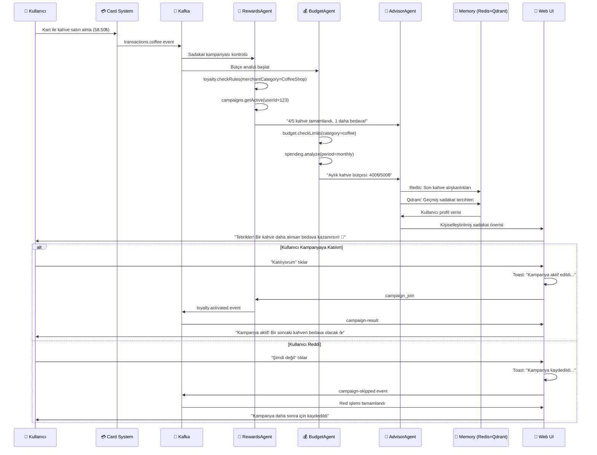
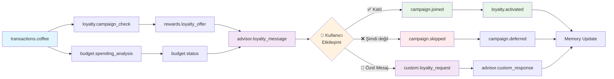

# 📋 PRD: Kahve Satın Alma Senaryosu - Sadakat Kampanyası Multi-Agent Sistemi

<div align="center">


**Finansal Agentic AI - Kahve Satın Alma & Sadakat Kampanyası Teknik Dokümantasyonu**

</div>

## 🎯 1. Proje Amacı

Bu PRD (Product Requirements Document), **kart ile kahve satın alma** durumunda otomatik olarak devreye giren akıllı sadakat kampanyası ve bütçe takip sisteminin teknik gereksinimlerini tanımlar.

### 📝 Senaryo Özeti

Kullanıcı kart ile kahve satın aldığında:
- 🛍️ **Card Transaction Service** işlemi Kafka'ya yayınlar
- 🎁 **RewardsAgent** sadakat kampanyalarını tespit eder
- 💰 **BudgetAgent** kahve harcama analizini yapar
- 🎯 **AdvisorAgent** kişiselleştirilmiş öneri oluşturur
- 📱 Kullanıcıya gerçek zamanlı bildirim gönderilir

## 🎭 2. Aktörler ve Rolleri

### 2.1 🤖 Agent Rolleri

<div align="center">

| Agent | Rol | MCP Tools | Görev | Çıktı |
|-------|-----|-----------|-------|-------|
| **🎁 RewardsAgent** | Sadakat Uzmanı | `loyalty.checkRules`<br/>`campaigns.getActive`<br/>`rewards.calculate` | Kampanya eşleştirme<br/>Sadakat puanı hesaplama<br/>Öneri oluşturma | Kampanya önerisi<br/>Sadakat durumu |
| **💰 BudgetAgent** | Bütçe Analisti | `budget.checkLimits`<br/>`transactions.categorize`<br/>`spending.analyze` | Kahve harcama analizi<br/>Bütçe kontrolü<br/>Trend analizi | Harcama raporu<br/>Bütçe durumu |
| **🎯 AdvisorAgent** | Ana Koordinatör | External LLM API<br/>(Hugging Face/OpenAI) | Tüm ajanların çıktısını toplar<br/>Memory'den veri alır<br/>Kişiselleştirilmiş mesaj oluşturur | Final öneri<br/>Kullanıcı mesajı |

</div>

### 2.2 🧠 Memory Katmanları

#### 🔴 Short-Term Memory (Redis)
- **Amaç**: Günlük kahve alışkanlıkları
- **İçerik**: 
  - Son 24 saatteki kahve satın alımları
  - Güncel sadakat kampanyası durumu
  - Kullanıcı tercihleri (kahve türü, mekan)
- **TTL**: 24 saat
- **Kullanım**: Hızlı kampanya eşleştirmesi

#### 🔵 Long-Term Memory (Qdrant Vector DB)
- **Amaç**: Uzun vadeli alışkanlık analizi
- **İçerik**:
  - Kahve satın alma geçmişi ve tercihleri
  - Sadakat kampanyası yanıt geçmişi
  - Merchant ve lokasyon tercihleri
- **Kullanım**: RAG (Retrieval Augmented Generation) için AdvisorAgent'a sağlanır

### 2.3 🔧 Tool Calling Mimarisi

<div align="center">

| Agent Kategorisi | LLM | Kullanım Alanı | Örnek |
|------------------|-----|----------------|-------|
| **Non-Advisor Agents** | Ollama + LLaMA<br/>(Hafif tool-calling modeli) | Tool çağrıları<br/>Basit analizler | `loyalty.checkRules()`<br/>`budget.checkLimits()` |
| **AdvisorAgent** | External LLM API<br/>(Hugging Face/OpenAI) | RAG + Memory<br/>Enriched final message | Kişiselleştirilmiş sadakat önerisi<br/>Kullanıcı mesajı |

</div>

## 🏗️ 3. Teknoloji Yığını

### 3.1 🔧 Backend Orkestrasyon

<div align="center">

| Teknoloji | Rol | Açıklama |
|-----------|-----|----------|
| **🐍 Python LangGraph** | Agent Workflow Orchestration | Multi-agent koordinasyonu ve workflow yönetimi |
| **🌐 Flask REST API** | Dış Dünya Servisleri | Kafka event producer/consumer, MCP server integration |
| **📨 Apache Kafka** | Event Streaming | Mikroservisler arası asenkron iletişim |

</div>

### 3.2 🧠 Memory Sistemleri

<div align="center">

| Teknoloji | Kategori | Açıklama |
|-----------|----------|----------|
| **🔴 Redis** | Short-Term Memory | Günlük kahve alışkanlıkları ve kampanya durumu |
| **🔵 Qdrant** | Long-Term Memory | Vector embeddings ile uzun vadeli sadakat analizi |

</div>

### 3.3 🤖 LLM Katmanları

<div align="center">

| LLM | Kullanım Alanı | Agent |
|-----|----------------|-------|
| **🦙 Ollama (LLaMA)** | Tool-calling modeli | RewardsAgent, BudgetAgent |
| **🌐 External API** | RAG + Memory enriched | AdvisorAgent |

</div>

## 🔄 4. Örnek Senaryo - Kahve Satın Alma

### 📊 Senaryo Akış Diyagramı



### 📝 Detaylı Adım Adım Senaryo

#### 🔸 Adım 1: Event Tetikleme
```json
{
  "event": "transactions.coffee",
  "payload": {
    "transactionId": "tx_coffee_001",
    "customerId": "123",
    "amount": 58.50,
    "currency": "TRY",
    "merchant": "Starbucks Kadıköy",
    "merchantCategory": "CoffeeShop",
    "timestamp": "2025-09-24T09:15:00Z",
    "cardId": "card_456"
  },
  "meta": {
    "correlationId": "coffee_001",
    "source": "card_transaction_service"
  }
}
```

#### 🔸 Adım 2: RewardsAgent Analizi
**MCP Tool Çağrıları:**
```javascript
// Aktif kampanyaları kontrol et
loyalty.checkRules({
  customerId: "123",
  merchantCategory: "CoffeeShop",
  amount: 58.50
});

// Sadakat durumunu getir
campaigns.getActive({
  customerId: "123",
  campaignType: "coffee_loyalty"
});

// Ödül hesapla
rewards.calculate({
  customerId: "123",
  purchaseCount: 4,
  targetCount: 5
});
```

**Çıktı:**
> "Harika! Bu 4. kahven oldu. Bir kahve daha alırsan 5. kahve bedava!"

#### 🔸 Adım 3: BudgetAgent Analizi
**MCP Tool Çağrıları:**
```javascript
// Bütçe limitlerini kontrol et
budget.checkLimits({
  customerId: "123",
  category: "coffee",
  period: "monthly"
});

// İşlemi kategorize et
transactions.categorize({
  transactionId: "tx_coffee_001",
  amount: 58.50,
  merchant: "Starbucks Kadıköy"
});

// Harcama analizini yap
spending.analyze({
  customerId: "123",
  category: "coffee",
  period: "monthly"
});
```

**Sonuç:**
```json
{
  "monthlySpent": 400,
  "monthlyLimit": 500,
  "remainingBudget": 100,
  "averagePerCoffee": 55,
  "frequencyPerWeek": 3.2
}
```

**Çıktı:**
> "Bu ay kahveye 400₺ harcadın (limit: 500₺). Ortalama kahve fiyatın 55₺."

#### 🔸 Adım 4: AdvisorAgent Entegrasyonu
**Input Veriler:**
- **RewardsAgent** → "4/5 kahve, 1 daha bedava"
- **BudgetAgent** → "400₺/500₺ aylık limit"
- **Redis** → Son kahve alışkanlıkları (Starbucks tercih ediyor)
- **Qdrant** → Geçmiş kampanya katılımları (genelde katılıyor)

**RAG Process:**
```python
# Qdrant'dan benzer kahve alışkanlıklarını bul
similar_cases = qdrant.search(
    query="coffee loyalty campaign participation",
    filter={"customerId": "123"},
    limit=5
)

# Redis'den son kahve alışkanlıklarını al
recent_coffee_habits = redis.get("customer:123:coffee_habits:24h")

# LLM ile kişiselleştirilmiş mesaj oluştur
final_message = llm.generate(
    context={
        "rewards": rewards_output,
        "budget": budget_output,
        "history": similar_cases,
        "preferences": recent_coffee_habits
    }
)
```

**Final Output:**
> "🎉 Tebrikler! Starbucks Kadıköy'den 4. kahveni aldın. Bir kahve daha alırsan 5. kahve bedava olacak! Bu ay kahve bütçende 100₺ kaldı, rahatça bir kahve daha alabilirsin. Katılmak ister misin?"

#### 🔸 Adım 5: Kullanıcı Etkileşimi

**UI Bildirimi:**
```json
{
  "type": "loyalty_campaign",
  "title": "Sadakat Kampanyası Fırsatı! ☕",
  "message": "Starbucks'ta 4. kahveni aldın!",
  "campaign": {
    "name": "5 Kahvede 1 Bedava",
    "progress": {
      "current": 4,
      "target": 5
    },
    "reward": "Bir sonraki kahve bedava",
    "expires": "2025-09-30T23:59:59Z"
  },
  "budget": {
    "spent": 400,
    "limit": 500,
    "remaining": 100
  },
  "actions": ["join_campaign", "skip", "custom_message"]
}
```

## 📨 5. Kafka Topics (Event-Driven Yapı)

### 5.1 📋 Event Topics

<div align="center">

| Topic | Açıklama | Payload Örneği |
|-------|----------|----------------|
| **`transactions.coffee`** | Kahve satın alma işlemi | `{customerId, amount, merchant, merchantCategory}` |
| **`loyalty.campaign_check`** | Kampanya kontrol isteği | `{customerId, merchantCategory, amount}` |
| **`budget.spending_analysis`** | Harcama analizi | `{customerId, category, period, amount}` |
| **`rewards.loyalty_offer`** | Sadakat kampanyası önerisi | `{customerId, campaign, progress, reward}` |
| **`advisor.loyalty_message`** | Kullanıcıya sunulan nihai mesaj | `{customerId, message, campaign}` |
| **`campaign.joined`** | Kampanya katılım onayı | `{customerId, campaignId, timestamp}` |
| **`campaign.skipped`** | Kampanya red edildi | `{customerId, campaignId, reason}` |
| **`loyalty.reward_earned`** | Ödül kazanıldı | `{customerId, rewardType, value}` |

</div>

### 5.2 🔄 Event Flow



## 🎨 6. UI Akışı ve Kullanıcı Deneyimi

### 6.1 📱 Sadakat Kampanyası Bildirim Kartı

```html
<div class="loyalty-notification-card">
  <div class="header">
    <span class="icon">☕</span>
    <h3>Sadakat Kampanyası Fırsatı!</h3>
  </div>
  
  <div class="content">
    <div class="merchant-info">
      <p class="merchant">📍 Starbucks Kadıköy</p>
      <p class="amount">58.50₺</p>
    </div>
    
    <div class="campaign-progress">
      <h4>🎯 5 Kahvede 1 Bedava</h4>
      <div class="progress-bar">
        <div class="progress" style="width: 80%"></div>
      </div>
      <p class="progress-text">4/5 kahve tamamlandı! 🎉</p>
    </div>
    
    <div class="budget-summary">
      <p><strong>Bu ay:</strong> 400₺/500₺ (100₺ kaldı)</p>
      <p><strong>Ortalama:</strong> 55₺ per kahve</p>
    </div>
    
    <!-- Collapse Edilebilir Detaylar -->
    <div class="campaign-details">
      <div class="collapse-header" onclick="toggleCollapse('campaign-details')">
        <span>📋 Kampanya Detayları</span>
        <span class="collapse-icon">▶️</span>
      </div>
      <div class="json-content" id="campaign-details" style="display: none;">
        <pre>{JSON kampanya detayları}</pre>
      </div>
    </div>
  </div>
  
  <div class="actions">
    <button class="join-campaign" disabled="false">🎯 Katılıyorum</button>
    <button class="skip-campaign" disabled="false">⏭️ Şimdi Değil</button>
    <button class="custom-message" disabled="false">💬 Özel İstek</button>
  </div>
  
  <!-- Toast Mesaj Sistemi -->
  <div class="toast-message" id="loyalty-toast">
    <span class="toast-icon">🎉</span>
    <span class="toast-text">Kampanya aktif ediliyor...</span>
  </div>
</div>
```

### 6.2 🔄 Real-time Event Handling

```javascript
// Kahve satın alma event'ini dinle
eventSource.addEventListener('transactions.coffee', (event) => {
  const data = JSON.parse(event.data);
  displayCoffeeTransaction(data.merchant, data.amount);
});

// Sadakat kampanyası önerisini dinle
eventSource.addEventListener('loyalty_campaign', (event) => {
  const data = JSON.parse(event.data);
  showLoyaltyNotification(data.campaign, data.budget);
  enableCampaignActions();
});

// Kampanya sonucunu dinle
eventSource.addEventListener('campaign-result', (event) => {
  const data = JSON.parse(event.data);
  updateCampaignStatus(data.result);
  disableLoadingState();
});

// Kampanya katılım fonksiyonu
function joinLoyaltyCampaign(campaignId, customerId) {
  // Butonları disabled yap
  disableAllButtons();
  
  // Toast mesaj göster
  showToast('Kampanya aktif ediliyor... 🎯');
  
  fetch('/api/loyalty/join', {
    method: 'POST',
    headers: { 'Content-Type': 'application/json' },
    body: JSON.stringify({
      customerId: customerId,
      campaignId: campaignId,
      action: 'join',
      timestamp: new Date().toISOString()
    })
  });
}

// Kampanya atlama fonksiyonu
function skipLoyaltyCampaign(campaignId, customerId) {
  disableAllButtons();
  showToast('Kampanya daha sonra için kaydediliyor... ⏭️');
  
  fetch('/api/loyalty/skip', {
    method: 'POST',
    headers: { 'Content-Type': 'application/json' },
    body: JSON.stringify({
      customerId: customerId,
      campaignId: campaignId,
      action: 'skip',
      reason: 'user_choice',
      timestamp: new Date().toISOString()
    })
  });
}
```

## 🔧 7. MCP Tools Implementasyonu

### 7.1 🎁 Loyalty & Rewards Tools

```javascript
// Sadakat kurallarını kontrol et
app.post('/loyalty.checkRules', (req, res) => {
  const { customerId, merchantCategory, amount } = req.body;
  
  // Mock loyalty rules
  const loyaltyRules = {
    coffee_5_plus_1: {
      merchantCategory: "CoffeeShop",
      requiredPurchases: 5,
      reward: "free_coffee",
      active: true
    }
  };
  
  // Müşterinin mevcut durumunu kontrol et
  const customerProgress = mockData.loyalty[customerId] || {
    coffee_purchases: 0,
    active_campaigns: []
  };
  
  const applicableRules = Object.entries(loyaltyRules)
    .filter(([key, rule]) => rule.merchantCategory === merchantCategory)
    .map(([key, rule]) => ({
      campaignId: key,
      progress: customerProgress.coffee_purchases,
      target: rule.requiredPurchases,
      reward: rule.reward,
      eligible: customerProgress.coffee_purchases < rule.requiredPurchases
    }));
  
  return res.json({
    customerId,
    applicableRules,
    currentProgress: customerProgress
  });
});

// Aktif kampanyaları getir
app.post('/campaigns.getActive', (req, res) => {
  const { customerId, campaignType } = req.body;
  
  const activeCampaigns = [
    {
      campaignId: "coffee_5_plus_1",
      name: "5 Kahvede 1 Bedava",
      type: "coffee_loyalty",
      description: "Her 5 kahve alımında 1 kahve bedava",
      progress: mockData.loyalty[customerId]?.coffee_purchases || 0,
      target: 5,
      reward: "free_coffee",
      expires: "2025-12-31T23:59:59Z"
    }
  ];
  
  return res.json({
    customerId,
    activeCampaigns: activeCampaigns.filter(c => 
      !campaignType || c.type === campaignType
    )
  });
});

// Ödül hesapla
app.post('/rewards.calculate', (req, res) => {
  const { customerId, purchaseCount, targetCount } = req.body;
  
  const remainingPurchases = Math.max(0, targetCount - purchaseCount);
  const progressPercentage = Math.min(100, (purchaseCount / targetCount) * 100);
  
  return res.json({
    customerId,
    currentCount: purchaseCount,
    targetCount,
    remainingCount: remainingPurchases,
    progressPercentage,
    nextReward: remainingPurchases === 0 ? "free_coffee" : null,
    rewardEarned: remainingPurchases === 0
  });
});
```

### 7.2 💰 Budget & Spending Tools

```javascript
// Bütçe limitlerini kontrol et
app.post('/budget.checkLimits', (req, res) => {
  const { customerId, category, period } = req.body;
  
  const budgetLimits = {
    coffee: { monthly: 500, daily: 20 },
    dining: { monthly: 1000, daily: 50 },
    shopping: { monthly: 2000, daily: 100 }
  };
  
  const currentSpending = mockData.spending[customerId] || {
    coffee: { monthly: 400, daily: 15 },
    dining: { monthly: 750, daily: 25 }
  };
  
  const limit = budgetLimits[category]?.[period] || 0;
  const spent = currentSpending[category]?.[period] || 0;
  const remaining = Math.max(0, limit - spent);
  const utilizationRate = limit > 0 ? (spent / limit) * 100 : 0;
  
  return res.json({
    customerId,
    category,
    period,
    limit,
    spent,
    remaining,
    utilizationRate,
    status: utilizationRate > 90 ? "warning" : utilizationRate > 100 ? "exceeded" : "ok"
  });
});

// İşlemi kategorize et
app.post('/transactions.categorize', (req, res) => {
  const { transactionId, amount, merchant } = req.body;
  
  // Merchant kategorileri
  const merchantCategories = {
    "starbucks": "coffee",
    "kahve dünyası": "coffee",
    "mcdonald": "dining",
    "burger king": "dining",
    "migros": "grocery",
    "teknosa": "electronics"
  };
  
  const merchantLower = merchant.toLowerCase();
  const category = Object.entries(merchantCategories)
    .find(([key, value]) => merchantLower.includes(key))?.[1] || "other";
  
  return res.json({
    transactionId,
    originalMerchant: merchant,
    category,
    amount,
    confidence: merchantLower.includes("coffee") || merchantLower.includes("kahve") ? 0.95 : 0.8
  });
});

// Harcama analizi yap
app.post('/spending.analyze', (req, res) => {
  const { customerId, category, period } = req.body;
  
  const spendingData = mockData.spending[customerId]?.[category] || {};
  const historicalData = mockData.historical[customerId]?.[category] || {};
  
  const analysis = {
    currentPeriod: {
      spent: spendingData[period] || 0,
      transactionCount: spendingData.transactionCount || 0,
      averagePerTransaction: spendingData.averageAmount || 0
    },
    trends: {
      compared_to_last_period: historicalData.trend || "stable",
      percentage_change: historicalData.change || 0
    },
    insights: [
      spendingData[period] > 400 ? "Yüksek kahve harcaması" : "Normal kahve harcaması",
      spendingData.transactionCount > 20 ? "Sık kahve alımı" : "Orta seviye kahve alımı"
    ]
  };
  
  return res.json({
    customerId,
    category,
    period,
    analysis
  });
});
```

## 🚀 8. Deployment ve Test

### 8.1 📝 Test Senaryoları

```python
def test_coffee_loyalty_scenario():
    """Kahve satın alma sadakat senaryosu testi"""
    # 1. Kahve satın alma event'i gönder
    coffee_event = {
        "transactionId": "tx_coffee_001",
        "customerId": "test_user",
        "amount": 58.50,
        "merchant": "Starbucks Kadıköy",
        "merchantCategory": "CoffeeShop",
        "timestamp": "2025-09-24T09:15:00Z"
    }
    
    # 2. Kafka event gönder
    kafka_producer.send("transactions.coffee", coffee_event)
    
    # 3. Agent çıktılarını bekle
    rewards_output = wait_for_agent_output("RewardsAgent", timeout=30)
    budget_output = wait_for_agent_output("BudgetAgent", timeout=30)
    advisor_output = wait_for_agent_output("AdvisorAgent", timeout=60)
    
    # 4. Assertions
    assert rewards_output.campaign_eligible == True
    assert rewards_output.progress == 4
    assert budget_output.remaining_budget > 0
    assert "bedava" in advisor_output.message.lower()
```

## 🆕 9. Son Güncellemeler ve Yeni Özellikler

### 9.1 ✨ Kahve Senaryosu Özellikleri

#### 🎯 Sadakat Kampanyası Sistemi
- **Özellik**: Gerçek zamanlı kampanya eşleştirme
- **Algoritma**: Merchant kategori bazlı kural motoru
- **Takip**: Progress bar ile görsel ilerleme
- **Ödül**: Otomatik ödül hesaplama

#### 💰 Akıllı Bütçe Takibi
- **Özellik**: Kategori bazlı harcama analizi
- **Limit**: Günlük/aylık bütçe kontrolü
- **Trend**: Geçmiş dönem karşılaştırması
- **Uyarı**: Limit aşım bildirimleri

#### 🤖 Multi-Agent Koordinasyonu
- **RewardsAgent**: Sadakat kuralları ve kampanya yönetimi
- **BudgetAgent**: Harcama analizi ve bütçe kontrolü
- **AdvisorAgent**: Kişiselleştirilmiş öneri oluşturma

### 9.2 🔧 Teknik İyileştirmeler

#### 📨 Event-Driven Architecture
- **Kafka Topics**: Kahve özel event tipleri
- **Real-time Processing**: Anlık kampanya tespiti
- **Scalability**: Yüksek hacimli işlem desteği

#### 🧠 Memory Integration
- **Redis**: Günlük kahve alışkanlıkları
- **Qdrant**: Uzun vadeli sadakat analizi
- **RAG**: Geçmiş verilerle zenginleştirilmiş öneriler

---

<div align="center">

**📋 Bu PRD dokümantasyonu Kahve Satın Alma & Sadakat Kampanyası senaryosunun teknik gereksinimlerini detaylı olarak tanımlar.**

**🔄 Güncelleme Tarihi:** 2025-09-24  
**📝 Versiyon:** 1.0  
**👨‍💻 Geliştirici:** epazar20  
**🆕 Yeni Senaryo:** Kahve satın alma, sadakat kampanyası, bütçe takibi

</div>
