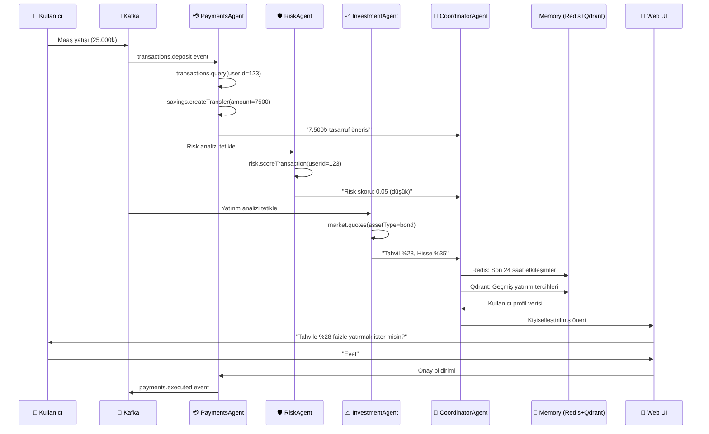
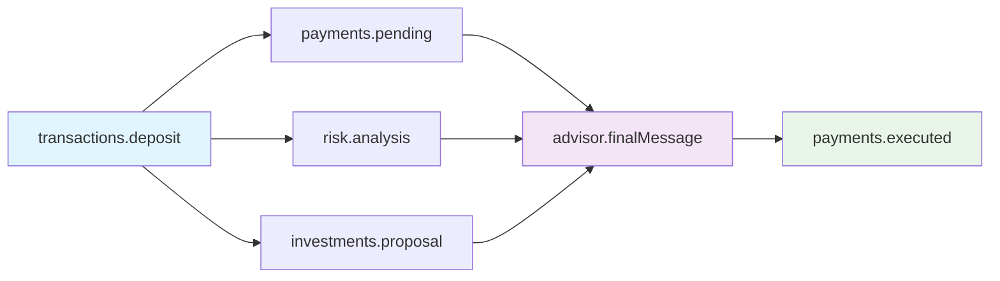
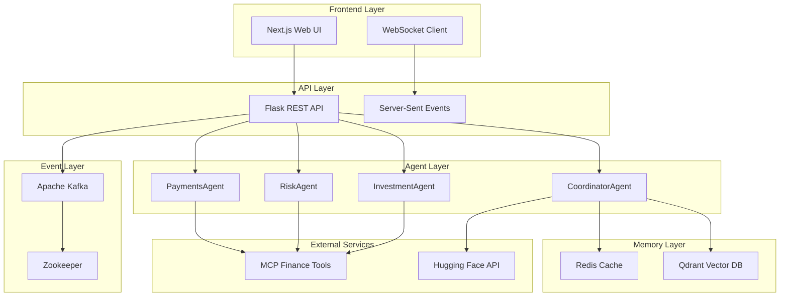

# 📋 PRD: Maaş Yatış Senaryosu - Multi-Agent + Memory Mimarisi

<div align="center">


**Finansal Agentic AI - Maaş Yatış Senaryosu Teknik Dokümantasyonu**

</div>

## 🎯 1. Proje Amacı

Bu PRD (Product Requirements Document), **maaş yatışı** durumunda otomatik olarak devreye giren akıllı finansal danışman sisteminin teknik gereksinimlerini tanımlar.

### 📝 Senaryo Özeti

Kullanıcıya maaş yatması durumunda:
- 🤖 **PaymentsAgent** otomatik işlemleri başlatır
- 🛡️ **RiskAgent** güvenlik ve uyum analizini yapar  
- 📈 **InvestmentAgent** yatırım fırsatları sunar
- 🎯 **CoordinatorAgent** tüm çıktıları Redis (short-term memory) ve Qdrant (long-term memory) ile zenginleştirir
- 📱 Son mesaj kullanıcıya bildirim olarak sunulur

## 🎭 2. Aktörler ve Rolleri

### 2.1 🤖 Agent Rolleri

<div align="center">

| Agent | Rol | MCP Tools | Görev | Çıktı |
|-------|-----|-----------|-------|-------|
| **💳 PaymentsAgent** | Finansal Analist | `transactions.query`<br/>`payments.create`<br/>`savings.createTransfer` | Maaş ödemesini algılama<br/>Bütçe planına göre öneri çıkarma<br/>Transfer hazırlama | Tasarruf önerisi<br/>Transfer planı |
| **🛡️ RiskAgent** | Risk Uzmanı | `risk.scoreTransaction`<br/>`kyc.check` | Gelen maaşın kaynağını analiz etme<br/>Sahtekarlık/kara para riskini kontrol etme | Risk skoru<br/>Güvenlik durumu |
| **📈 InvestmentAgent** | Yatırım Danışmanı | `market.quotes`<br/>`orders.*` | Maaş sonrası uygun yatırım ürünleri önerisi<br/>(Risk durumuna göre) | Yatırım önerileri<br/>Piyasa analizi |
| **🎯 CoordinatorAgent** | Ana Koordinatör | External LLM API<br/>(Hugging Face/OpenAI) | Tüm ajanların çıktısını toplar<br/>Memory'den veri alır<br/>Kişiselleştirilmiş mesaj oluşturur | Final öneri<br/>Kullanıcı mesajı |

</div>

### 2.2 🧠 Memory Katmanları

#### 🔴 Short-Term Memory (Redis)
- **Amaç**: Anlık kullanıcı etkileşimleri
- **İçerik**: 
  - Son konuşma/etkileşimler
  - Önceki 1 günlük onay/red geçmişi
  - Kullanıcı tercihleri ve davranışları
- **TTL**: 24 saat
- **Kullanım**: Hızlı erişim için

#### 🔵 Long-Term Memory (Qdrant Vector DB)
- **Amaç**: Geçmiş analizler ve öğrenme
- **İçerik**:
  - Benzer Kafka event türlerine verilen önceki analiz çıktıları
  - Nomic embed-text ile vektörleştirilmiş veriler
  - Kullanıcı yatırım geçmişi ve tercihleri
- **Kullanım**: RAG (Retrieval Augmented Generation) için Coordinator'a sağlanır

### 2.3 🔧 Tool Calling Mimarisi

<div align="center">

| Agent Kategorisi | LLM | Kullanım Alanı | Örnek |
|------------------|-----|----------------|-------|
| **Non-Coordinator Agents** | Ollama + LLaMA<br/>(Hafif tool-calling modeli) | Tool çağrıları<br/>Basit analizler | `transactions.query()`<br/>`risk.scoreTransaction()` |
| **CoordinatorAgent** | External LLM API<br/>(Hugging Face/OpenAI) | RAG + Memory<br/>Enriched final message | Kişiselleştirilmiş öneri<br/>Kullanıcı mesajı |

</div>

## 🏗️ 3. Teknoloji Yığını

### 3.1 🔧 Backend Orkestrasyon

<div align="center">

| Teknoloji | Rol | Açıklama |
|-----------|-----|----------|
| **🐍 Python LangGraph** | Agent Workflow Orchestration | Multi-agent koordinasyonu ve workflow yönetimi |
| **🌐 Flask REST API** | Dış Dünya Servisleri | Kafka event producer/consumer, MCP server integration |
| **📨 Apache Kafka** | Event Streaming | Mikroservisler arası asenkron iletişim |

</div>

### 3.2 🧠 Memory Sistemleri

<div align="center">

| Teknoloji | Kategori | Açıklama |
|-----------|----------|----------|
| **🔴 Redis** | Short-Term Memory | Hızlı erişim için geçici veri saklama |
| **🔵 Qdrant** | Long-Term Memory | Vector embeddings ile uzun vadeli öğrenme |

</div>

### 3.3 🤖 LLM Katmanları

<div align="center">

| LLM | Kullanım Alanı | Agent |
|-----|----------------|-------|
| **🦙 Ollama (LLaMA)** | Tool-calling modeli | PaymentsAgent, RiskAgent, InvestmentAgent |
| **🌐 External API** | RAG + Memory enriched | CoordinatorAgent |

</div>

### 3.4 🎨 UI/Frontend

<div align="center">

| Teknoloji | Açıklama |
|-----------|----------|
| **🔌 WebSocket** | Real-time bildirim + prompt input |
| **⚡ Server-Sent Events** | Event streaming |
| **🌐 Next.js** | Modern web arayüzü |

</div>

## 🔄 4. Örnek Senaryo - Maaş Yatışı

### 📊 Senaryo Akış Diyagramı



### 📝 Detaylı Adım Adım Senaryo

#### 🔸 Adım 1: Event Tetikleme
```json
{
  "event": "transactions.deposit",
  "payload": {
    "userId": "123",
    "amount": 25000,
    "timestamp": "2025-09-09T10:00:00Z"
  },
  "meta": {
    "correlationId": "deposit_001",
    "source": "banking_system"
  }
}
```

#### 🔸 Adım 2: PaymentsAgent Analizi
**MCP Tool Çağrıları:**
```javascript
// Geçmiş işlemleri sorgula
transactions.query({
  userId: "123",
  since: "last30d"
});

// Tasarruf transferi öner
savings.createTransfer({
  userId: "123",
  amount: 7500,
  status: "pending"
});
```

**Çıktı:**
> "Maaşın 25.000₺ olarak hesabına geçti. Plan gereği 7.500₺ tasarrufa aktarılabilir."

#### 🔸 Adım 3: RiskAgent Analizi
**MCP Tool Çağrıları:**
```javascript
// Risk skoru hesapla
risk.scoreTransaction({
  userId: "123",
  transaction: {
    type: "deposit",
    amount: 25000,
    source: "salary"
  }
});
```

**Sonuç:**
```json
{
  "score": 0.05,
  "reason": "low risk",
  "factors": ["regular_salary", "known_source", "normal_amount"]
}
```

**Çıktı:**
> "İşlem güvenli, düşük riskli."

#### 🔸 Adım 4: InvestmentAgent Analizi
**Risk Bazlı Strateji:**
- **Low Risk (0.05)** → Agresif yatırım önerileri
- **High Risk (>0.7)** → Temkinli ürünler

**MCP Tool Çağrıları:**
```javascript
// Piyasa verilerini al
market.quotes({
  assetType: "bond",
  tenor: "6m"
});

market.quotes({
  assetType: "equity",
  market: "BIST"
});
```

**Çıktı:**
> "6 aylık tahvil faizi %28, BES fonu %22, hisse senedi endeksi yıllık %35"

#### 🔸 Adım 5: CoordinatorAgent Entegrasyonu
**Input Veriler:**
- **PaymentsAgent** → "25.000₺ maaş, 7.500₺ tasarruf önerisi"
- **RiskAgent** → "low risk (0.05)"
- **InvestmentAgent** → "bond %28, equity %35"
- **Redis** → Son 24 saatteki kullanıcı cevapları ("Evet" → otomatik onay eğilimi)
- **Qdrant** → Önceki benzer maaş yatırımlarında kullanıcı hep tahvil seçmiş

**RAG Process:**
```python
# Qdrant'dan benzer durumları bul
similar_cases = qdrant.search(
    query="salary deposit investment preference",
    filter={"userId": "123"},
    limit=5
)

# Redis'den son etkileşimleri al
recent_interactions = redis.get("user:123:interactions:24h")

# LLM ile kişiselleştirilmiş mesaj oluştur
final_message = llm.generate(
    context={
        "payments": payments_output,
        "risk": risk_output,
        "investment": investment_output,
        "history": similar_cases,
        "preferences": recent_interactions
    }
)
```

**Final Output:**
> "Maaşın 25.000₺ olarak yattı ✅. Bütçene göre 7.500₺ tasarrufa aktarabilirim. Risk puanın düşük görünüyor, önceki tercihlerin de tahvil yönünde olmuş. Bu kez tahvile %28 faizle yatırmak ister misin?"

#### 🔸 Adım 6: Kullanıcı Etkileşimi
**UI Bildirimi:**
```json
{
  "type": "notification",
  "title": "Maaş Yatışı Bildirimi",
  "message": "Maaşın 25.000₺ olarak yattı ✅",
  "proposal": {
    "action": "transfer_to_savings",
    "amount": 7500,
    "investment": {
      "type": "bond",
      "rate": 0.28,
      "duration": "6m"
    }
  },
  "actions": ["approve", "reject", "modify"]
}
```

**Kullanıcı Yanıtı:**
- **"Evet"** → Transfer execute edilir
- **"Hayır"** → İşlem iptal edilir
- **"Değiştir"** → Öneri modifikasyonu

**Final Execution:**
```json
{
  "event": "payments.executed",
  "payload": {
    "userId": "123",
    "transactionId": "tx_789",
    "amount": 7500,
    "status": "completed",
    "timestamp": "2025-09-09T10:05:00Z"
  }
}
```

## 📨 5. Kafka Topics (Event-Driven Yapı)

### 5.1 📋 Event Topics

<div align="center">

| Topic | Açıklama | Payload Örneği |
|-------|----------|----------------|
| **`transactions.deposit`** | Yeni maaş yatışı | `{userId, amount, timestamp}` |
| **`payments.pending`** | Önerilen otomatik transfer | `{userId, amount, from, to}` |
| **`risk.analysis`** | RiskAgent çıktısı | `{userId, score, reason, factors}` |
| **`investments.proposal`** | Yatırım önerisi | `{userId, products, rates, risk}` |
| **`advisor.finalMessage`** | Kullanıcıya sunulan nihai mesaj | `{userId, message, proposal}` |
| **`payments.executed`** | Onay sonrası işlem sonucu | `{userId, txId, status, amount}` |

</div>

### 5.2 🔄 Event Flow



## 🎨 6. UI Akışı ve Kullanıcı Deneyimi

### 6.1 📱 Bildirim Kartı Tasarımı

```html
<div class="notification-card">
  <div class="header">
    <span class="icon">💰</span>
    <h3>Maaş Yatışı Bildirimi</h3>
  </div>
  
  <div class="content">
    <p class="amount">Maaşın 25.000₺ yatırıldı.</p>
    <div class="proposal">
      <p><strong>Tasarruf:</strong> 7.500₺ aktarabilirim</p>
      <p><strong>Yatırım Önerisi:</strong> Tahvil %28</p>
      <p class="question">Onaylıyor musun?</p>
    </div>
  </div>
  
  <div class="actions">
    <button class="approve">✅ Evet</button>
    <button class="reject">❌ Hayır</button>
    <button class="modify">✏️ Değiştir</button>
  </div>
</div>
```

### 6.2 🔄 Real-time Event Handling

```javascript
// WebSocket bağlantısı
const ws = new WebSocket('ws://localhost:5001/ws');

// Event dinleyicileri
ws.onmessage = (event) => {
  const data = JSON.parse(event.data);
  
  switch(data.type) {
    case 'agent-output':
      displayAgentOutput(data.agent, data.message);
      break;
    case 'notification':
      showNotification(data.message, data.proposal);
      break;
    case 'execution':
      updateTransactionStatus(data.result);
      break;
  }
};

// Kullanıcı aksiyonu
function handleUserAction(action, proposal) {
  fetch('/api/action', {
    method: 'POST',
    headers: { 'Content-Type': 'application/json' },
    body: JSON.stringify({
      userId: getCurrentUserId(),
      response: action,
      proposal: proposal,
      correlationId: getCurrentCorrelationId()
    })
  });
}
```

### 6.3 📊 Dashboard Görünümü

<div align="center">

| Bölüm | İçerik | Güncelleme |
|-------|--------|------------|
| **💰 Maaş Durumu** | Yatış miktarı, tarih | Real-time |
| **📈 Yatırım Önerileri** | Tahvil, hisse, fon oranları | Piyasa verileri |
| **🛡️ Risk Analizi** | Risk skoru, güvenlik durumu | Agent çıktısı |
| **📋 Bekleyen İşlemler** | Onay bekleyen transferler | Kullanıcı aksiyonu |

</div>

## 🔧 7. Teknik Implementasyon Detayları

### 7.1 🏗️ Mimari Bileşenler



### 7.2 🔧 Konfigürasyon Parametreleri

```yaml
# Agent Konfigürasyonu
agents:
  payments:
    savings_rate: 0.30  # %30 otomatik tasarruf
    min_amount: 1000    # Minimum transfer miktarı
    
  risk:
    low_threshold: 0.3  # Düşük risk eşiği
    high_threshold: 0.7 # Yüksek risk eşiği
    
  investment:
    bond_weight: 0.4    # Tahvil ağırlığı
    equity_weight: 0.3  # Hisse ağırlığı
    fund_weight: 0.3    # Fon ağırlığı

# Memory Konfigürasyonu
memory:
  redis:
    ttl: 86400          # 24 saat TTL
    max_connections: 10
    
  qdrant:
    vector_size: 768    # Embedding boyutu
    distance: "cosine"   # Mesafe metriği
    collection: "user_preferences"

# Kafka Konfigürasyonu
kafka:
  bootstrap_servers: "localhost:9092"
  topics:
    deposit: "transactions.deposit"
    pending: "payments.pending"
    risk: "risk.analysis"
    investment: "investments.proposal"
    advisor: "advisor.finalMessage"
    executed: "payments.executed"
```

### 7.3 🧪 Test Senaryoları

#### 🔸 Unit Test Senaryoları
```python
def test_payments_agent():
    """PaymentsAgent'in maaş analizi testi"""
    agent = PaymentsAgent()
    result = agent.analyze_salary_deposit(user_id="123", amount=25000)
    
    assert result.savings_amount == 7500  # %30 tasarruf
    assert result.status == "pending"
    assert result.from_account == "CHK001"
    assert result.to_account == "SV001"

def test_risk_agent():
    """RiskAgent'in risk analizi testi"""
    agent = RiskAgent()
    result = agent.analyze_transaction(user_id="123", amount=25000)
    
    assert result.score <= 1.0
    assert result.score >= 0.0
    assert result.reason in ["low risk", "medium risk", "high risk"]

def test_investment_agent():
    """InvestmentAgent'in yatırım önerisi testi"""
    agent = InvestmentAgent()
    result = agent.get_investment_recommendations(risk_score=0.05)
    
    assert len(result.products) > 0
    assert all(p.rate > 0 for p in result.products)
    assert result.strategy == "aggressive"  # Düşük risk = agresif
```

#### 🔸 Integration Test Senaryoları
```python
def test_end_to_end_scenario():
    """Tam senaryo testi"""
    # 1. Maaş yatışı simüle et
    deposit_event = {
        "userId": "test_user",
        "amount": 25000,
        "timestamp": "2025-09-09T10:00:00Z"
    }
    
    # 2. Kafka event gönder
    kafka_producer.send("transactions.deposit", deposit_event)
    
    # 3. Agent çıktılarını bekle
    payments_output = wait_for_agent_output("PaymentsAgent", timeout=30)
    risk_output = wait_for_agent_output("RiskAgent", timeout=30)
    investment_output = wait_for_agent_output("InvestmentAgent", timeout=30)
    
    # 4. CoordinatorAgent çıktısını bekle
    final_message = wait_for_agent_output("CoordinatorAgent", timeout=60)
    
    # 5. Assertions
    assert payments_output.savings_amount == 7500
    assert risk_output.score < 0.3  # Düşük risk
    assert len(investment_output.products) > 0
    assert "tahvil" in final_message.message.lower()
```

## 📈 8. Performans ve Ölçeklenebilirlik

### 8.1 📊 Performans Metrikleri

<div align="center">

| Metrik | Hedef | Ölçüm |
|--------|-------|-------|
| **Response Time** | < 2 saniye | Agent çıktısı |
| **Throughput** | 1000 req/s | Eşzamanlı kullanıcı |
| **Memory Usage** | < 512MB | Redis cache |
| **Vector Search** | < 100ms | Qdrant query |
| **Kafka Latency** | < 50ms | Event processing |

</div>

### 8.2 🔧 Ölçeklenebilirlik Stratejisi

```yaml
# Horizontal Scaling
scaling:
  agents:
    replicas: 3
    load_balancer: "round_robin"
    
  kafka:
    partitions: 12
    replication_factor: 3
    
  redis:
    cluster_mode: true
    nodes: 6
    
  qdrant:
    shards: 4
    replicas: 2

# Vertical Scaling
resources:
  payments_agent:
    cpu: "1000m"
    memory: "512Mi"
    
  coordinator_agent:
    cpu: "2000m"
    memory: "1Gi"
    
  redis:
    cpu: "500m"
    memory: "256Mi"
    
  qdrant:
    cpu: "1000m"
    memory: "512Mi"
```

## 🔒 9. Güvenlik ve Uyumluluk

### 9.1 🛡️ Güvenlik Önlemleri

<div align="center">

| Güvenlik Katmanı | Açıklama | Implementasyon |
|------------------|----------|----------------|
| **🔐 API Authentication** | JWT token tabanlı kimlik doğrulama | Flask-JWT-Extended |
| **🔒 Data Encryption** | Hassas verilerin şifrelenmesi | AES-256 |
| **🛡️ Input Validation** | Giriş verilerinin doğrulanması | Pydantic models |
| **🚫 Rate Limiting** | API isteklerinin sınırlandırılması | Flask-Limiter |
| **📝 Audit Logging** | Tüm işlemlerin kaydedilmesi | Structured logging |

</div>

### 9.2 📋 Uyumluluk Gereksinimleri

```yaml
compliance:
  gdpr:
    data_retention: "7_years"
    right_to_forget: true
    data_portability: true
    
  pci_dss:
    card_data_encryption: true
    secure_transmission: true
    access_control: true
    
  sox:
    financial_reporting: true
    internal_controls: true
    audit_trail: true
```

## 🚀 10. Deployment ve DevOps

### 10.1 🐳 Container Orchestration

```yaml
# docker-compose.yml
version: '3.8'
services:
  langgraph-agents:
    build: ./langgraph-agents
    ports:
      - "5001:5000"
    environment:
      - HUGGINGFACE_API_KEY=${HUGGINGFACE_API_KEY}
      - REDIS_URL=redis://financial-redis:6379/0
      - QDRANT_HOST=financial-qdrant
      - KAFKA_BOOTSTRAP_SERVERS=financial-kafka:9092
    depends_on:
      - financial-redis
      - financial-qdrant
      - financial-kafka
      
  mcp-finance-tools:
    build: ./mcp-finance-tools
    ports:
      - "4000:4000"
      
  web-ui:
    build: ./web-ui
    ports:
      - "3000:3000"
    environment:
      - NEXT_PUBLIC_API_URL=http://localhost:5001
```

### 10.2 🔄 CI/CD Pipeline

```yaml
# .github/workflows/deploy.yml
name: Deploy Financial Agentic AI

on:
  push:
    branches: [main]

jobs:
  test:
    runs-on: ubuntu-latest
    steps:
      - uses: actions/checkout@v3
      - name: Run Tests
        run: |
          docker-compose -f docker-compose.test.yml up --abort-on-container-exit
          
  deploy:
    needs: test
    runs-on: ubuntu-latest
    steps:
      - name: Deploy to Production
        run: |
          docker-compose -f docker-compose.prod.yml up -d
```

## 📚 11. Dokümantasyon ve Kaynaklar

### 11.1 📖 Teknik Dokümantasyon

- [API Documentation](http://localhost:5001/docs) - Swagger/OpenAPI
- [Agent Architecture](docs/architecture.md) - Detaylı mimari açıklaması
- [Memory Systems](docs/memory.md) - Redis ve Qdrant kullanımı
- [Event Flow](docs/events.md) - Kafka event akışı
- [Testing Guide](docs/testing.md) - Test stratejileri

### 11.2 🔗 Dış Kaynaklar

- [LangGraph Documentation](https://langchain-ai.github.io/langgraph/)
- [Apache Kafka Guide](https://kafka.apache.org/documentation/)
- [Qdrant Vector Database](https://qdrant.tech/documentation/)
- [Redis Documentation](https://redis.io/documentation)
- [Hugging Face API](https://huggingface.co/docs/api-inference)

---

<div align="center">

**📋 Bu PRD dokümantasyonu Financial Agentic AI projesinin teknik gereksinimlerini detaylı olarak tanımlar.**

**🔄 Güncelleme Tarihi:** 2025-09-09  
**📝 Versiyon:** 2.0  
**👨‍💻 Geliştirici:** epazar20

</div>
