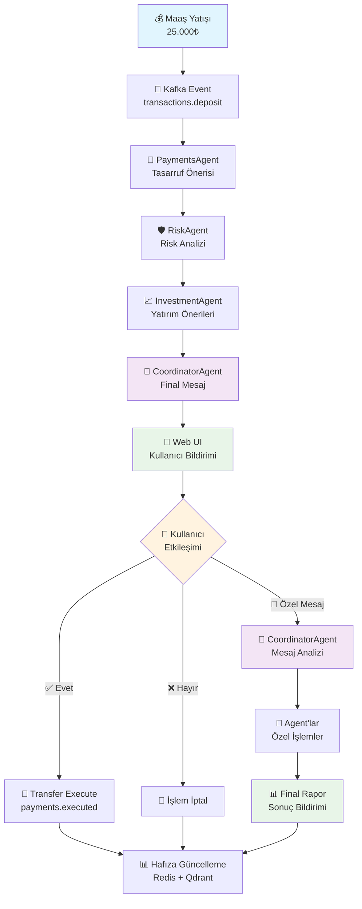
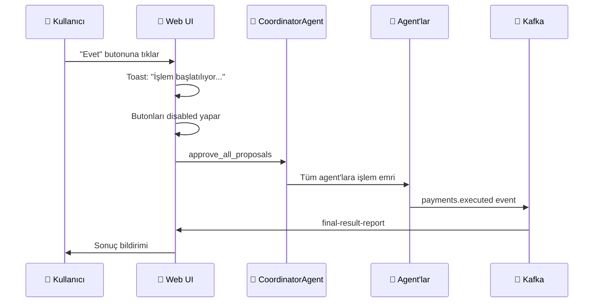
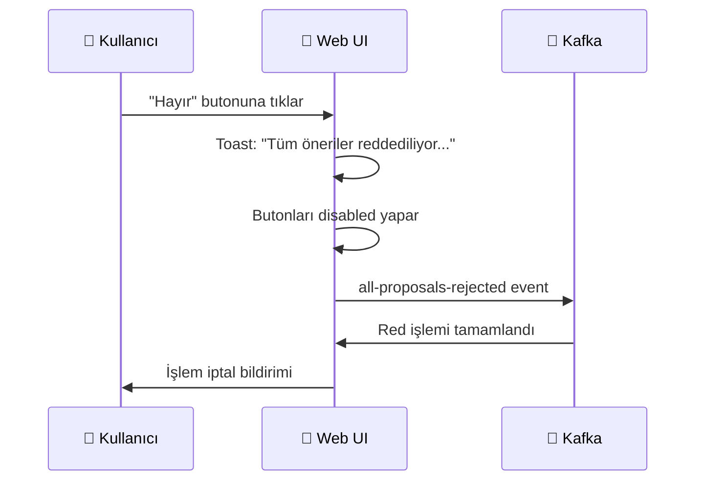
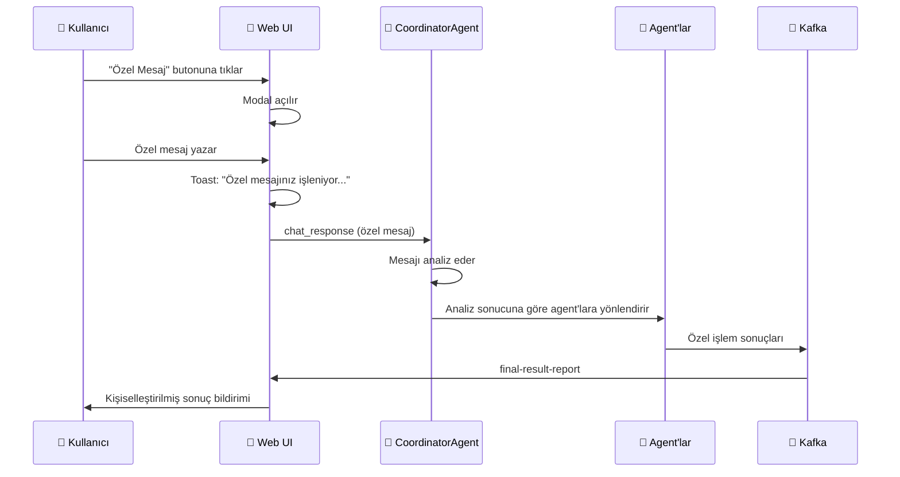

# 🏦 Financial Agentic AI - Maaş Yatış Senaryosu

<div align="center">


**Multi-Agent Finansal Danışman Sistemi**

*PRD_DEPOSIT.md senaryosuna göre geliştirilmiş akıllı maaş yatış analizi ve yatırım önerisi sistemi*

</div>

## 🎯 Proje Özeti

Bu proje, **maaş yatışı** durumunda otomatik olarak devreye giren akıllı finansal danışman sistemidir. Multi-agent mimarisi ile çalışan sistem, kullanıcının maaşını analiz eder, risk değerlendirmesi yapar ve kişiselleştirilmiş yatırım önerileri sunar.

### 🌟 Temel Özellikler

- 🤖 **4 Akıllı Agent**: PaymentsAgent, RiskAgent, InvestmentAgent, CoordinatorAgent
- 🧠 **Çift Hafıza Sistemi**: Redis (kısa vadeli) + Qdrant (uzun vadeli)
- 📡 **Real-time İletişim**: Kafka event streaming + Server-Sent Events
- 🎨 **Modern UI**: Next.js ile responsive web arayüzü
- 🔒 **Güvenli API**: Hugging Face LLM entegrasyonu
- 🔄 **RAG Sistemi**: Retrieval Augmented Generation ile akıllı öneriler
- 📱 **Toast Bildirimler**: Modern kullanıcı bildirim sistemi
- 🎯 **Collapse UI**: JSON içerikler için temiz görünüm

## 🔄 Maaş Yatış Senaryosu Akışı



## 🏗️ Sistem Mimarisi

### 🎭 Agent Rolleri

| Agent | Rol | Görev | Çıktı |
|-------|-----|-------|-------|
| **💳 PaymentsAgent** | Finansal Analist | Maaş analizi, tasarruf oranı hesaplama | %30 otomatik tasarruf önerisi |
| **🛡️ RiskAgent** | Risk Uzmanı | İşlem güvenliği, sahtekarlık kontrolü | Risk skoru (0-1) |
| **📈 InvestmentAgent** | Yatırım Danışmanı | Risk bazlı yatırım stratejisi | Tahvil, hisse, fon önerileri |
| **🎯 CoordinatorAgent** | Ana Koordinatör | Hafıza entegrasyonu, final mesaj | Kişiselleştirilmiş öneri |

### 🔧 Teknik Servisler

<div align="center">

| Servis | Teknoloji | Port | Açıklama |
|--------|-----------|------|----------|
| **🧠 LangGraph Agents** | Python + Flask | 5001 | Multi-agent orchestrator |
| **💰 MCP Finance Tools** | Node.js | 4000 | Finansal araçlar API'si |
| **🌐 Web UI** | Next.js | 3000 | Real-time bildirim arayüzü |
| **🗄️ Redis** | Redis | 6379 | Kısa vadeli hafıza |
| **🔍 Qdrant** | Vector DB | 6333 | Uzun vadeli hafıza |
| **📨 Kafka** | Event Streaming | 9092 | Mikroservis iletişimi |
| **🦙 Ollama** | Local LLM | 11434 | Embedding ve küçük modeller |

</div>

## 🚀 Hızlı Başlangıç

### 📋 Ön Gereksinimler

- 🐳 **Docker & Docker Compose**
- 🔑 **Hugging Face API Key** ([Almak için tıklayın](https://huggingface.co/settings/tokens))
- 💻 **Git** (repository clone için)

### ⚡ Tek Komutla Başlatma

```bash
# 1. Repository'yi clone edin
git clone https://github.com/epazar20/financial-agentic-ai.git
cd financial-agentic-ai

# 2. Environment variables ayarlayın
cp .env.example .env
# .env dosyasını düzenleyin ve HUGGINGFACE_API_KEY ekleyin

# 3. Tüm servisleri başlatın
docker-compose up -d

# 4. Sistem hazır! 🎉
```

### 🔧 Manuel Kurulum

<details>
<summary>Detaylı kurulum adımları</summary>

#### 1. Environment Variables Ayarlama

```bash
# .env dosyası oluşturun
cp .env.example .env

# .env dosyasını düzenleyin
nano .env
```

**Gerekli Değişkenler:**
```env
HUGGINGFACE_API_KEY=hf_your_api_key_here
HUGGINGFACE_API_URL=https://router.huggingface.co/novita/v3/openai/chat/completions
HUGGINGFACE_MODEL=deepseek/deepseek-v3-0324
```

#### 2. Docker Compose ile Çalıştırma

```bash
# Tüm servisleri build et ve çalıştır
docker-compose up --build -d

# Servis durumunu kontrol et
docker-compose ps

# Logları takip et
docker-compose logs -f langgraph-agents
```

#### 3. Servis Sağlık Kontrolü

```bash
# API Health Check
curl http://localhost:5001/health

# MCP Finance Tools
curl http://localhost:4000/health

# Web UI
curl http://localhost:3000
```

</details>

## 🧪 Canlı Demo ve Test Senaryoları

### 🎬 Senaryo 1: Web UI ile Maaş Yatışı

<div align="center">

| Adım | Açıklama | Sonuç |
|------|----------|-------|
| 🌐 **Web UI Aç** | http://localhost:3000 | Maaş yatış butonları görünür |
| 💳 **25.000₺ Butonu** | "Maaş Yatışı (API)" tıkla | PaymentsAgent devreye girer |
| 🤖 **Agent Çalışması** | RiskAgent → InvestmentAgent | Real-time bildirimler (JSON'lar kapalı) |
| 🎯 **Final Mesaj** | CoordinatorAgent çıktısı | Kişiselleştirilmiş öneri |
| 🔔 **Toast Bildirim** | "İşlem başlatılıyor..." | Kullanıcı bilgilendirilir |
| ✅ **Onay Seçenekleri** | "Evet", "Hayır", "Özel Mesaj" | Butonlar disabled olur |
| 💬 **Özel Mesaj** | Modal açılır, mesaj yazılır | CoordinatorAgent'e yönlendirilir |
| 🧠 **Mesaj Analizi** | CoordinatorAgent mesajı analiz eder | Agent'lara özel işlemler |
| 📊 **Final Rapor** | Tüm işlemler tamamlanır | Sonuç bildirimi |
| 📱 **Collapse UI** | JSON detayları tıklanabilir | Temiz görünüm |

</div>

## 💬 Kullanıcı Etkileşimi ve Onay Süreci

### 🎯 Etkileşim Senaryoları

#### ✅ Senaryo 1: Tüm Önerileri Onaylama


#### ❌ Senaryo 2: Tüm Önerileri Reddetme


#### 💬 Senaryo 3: Özel Mesaj ile İstek


### 🔧 API Test Komutları

#### 1. Maaş Yatışı Simülasyonu

```bash
curl -X POST http://localhost:5001/simulate_deposit \
  -H 'Content-Type: application/json' \
  -d '{
    "user_id": "demo_user",
    "amount": 25000,
    "correlation_id": "demo_001"
  }'
```

**Beklenen Yanıt:**
```json
{
  "correlationId": "demo_001",
  "status": "accepted",
  "message": "Maaş yatışı 25.000₺ olarak işleme alındı"
}
```

#### 2. Kafka Event Yayınlama

```bash
curl -X POST http://localhost:5001/kafka/publish \
  -H 'Content-Type: application/json' \
  -d '{
    "topic": "transactions.deposit",
    "data": {
      "payload": {
        "userId": "kafka_user",
        "amount": 30000
      },
      "meta": {
        "correlationId": "kafka_001",
        "timestamp": "2025-09-09T23:00:00Z"
      }
    }
  }'
```

#### 3. Kullanıcı Onayı

```bash
curl -X POST http://localhost:5001/action \
  -H 'Content-Type: application/json' \
  -d '{
    "userId": "demo_user",
    "response": "approve",
    "proposal": {
      "amount": 7500,
      "from": "CHK001",
      "to": "SV001"
    },
    "correlationId": "demo_001"
  }'
```

### 📊 Real-time Event Monitoring

```bash
# Server-Sent Events stream'i dinle
curl -N http://localhost:5001/stream

# Beklenen Event'ler:
# event: agent-output (PaymentsAgent)
# event: agent-output (RiskAgent)  
# event: agent-output (InvestmentAgent)
# event: notification (CoordinatorAgent)
# event: execution (Transfer sonucu)
```

## 🔒 Güvenlik ve Konfigürasyon

### 🛡️ Güvenlik Önlemleri

<div align="center">

| Güvenlik Katmanı | Açıklama | Durum |
|------------------|----------|-------|
| 🔐 **API Keys** | Environment variables'da saklanır | ✅ Güvenli |
| 🚫 **Git Protection** | `.env` dosyası git'e gönderilmez | ✅ Aktif |
| 🔒 **CORS** | Sadece belirtilen origin'lere izin | ✅ Yapılandırılmış |
| 🐳 **Container Isolation** | Docker ile servis izolasyonu | ✅ Aktif |

</div>

### ⚙️ Environment Variables

| Variable | Açıklama | Varsayılan | Zorunlu |
|----------|----------|------------|---------|
| `HUGGINGFACE_API_KEY` | Hugging Face API anahtarı | - | ✅ **Evet** |
| `HUGGINGFACE_API_URL` | Hugging Face API endpoint | `https://router.huggingface.co/novita/v3/openai/chat/completions` | ❌ |
| `HUGGINGFACE_MODEL` | Hugging Face model | `deepseek/deepseek-v3-0324` | ❌ |
| `REDIS_URL` | Redis bağlantı URL'si | `redis://financial-redis:6379/0` | ❌ |
| `QDRANT_HOST` | Qdrant host | `financial-qdrant` | ❌ |
| `QDRANT_PORT` | Qdrant port | `6333` | ❌ |
| `KAFKA_BOOTSTRAP_SERVERS` | Kafka servers | `financial-kafka:9092` | ❌ |
| `OLLAMA_BASE_URL` | Ollama base URL | `http://financial-ollama:11434` | ❌ |
| `MCP_BASE_URL` | MCP tools URL | `http://mcp-finance-tools:4000` | ❌ |
| `FLASK_HOST` | Flask host | `0.0.0.0` | ❌ |
| `FLASK_PORT` | Flask port | `5000` | ❌ |
| `FLASK_DEBUG` | Flask debug mode | `false` | ❌ |
| `CORS_ORIGINS` | CORS origins | `http://localhost:3000` | ❌ |

### 🔧 Güvenlik Kontrol Listesi

- [ ] `HUGGINGFACE_API_KEY` ayarlandı
- [ ] `.env` dosyası oluşturuldu
- [ ] Production'da `FLASK_DEBUG=false` ayarlandı
- [ ] CORS origins production URL'leri ile güncellendi
- [ ] SSL sertifikası production için hazırlandı
- [ ] Rate limiting eklendi
- [ ] Authentication/Authorization sistemi kuruldu

## 📁 Proje Yapısı

```
financial-agentic-ai/
├── 🧠 langgraph-agents/          # Multi-agent orchestrator
│   ├── app.py                    # Ana Flask uygulaması
│   ├── config.py                 # Konfigürasyon yönetimi
│   ├── services.py               # Servis bağlantıları (Redis, Qdrant, Kafka)
│   ├── workflow.py                # LangGraph multi-agent workflow
│   ├── api.py                    # REST API endpoints
│   ├── requirements.txt           # Python dependencies
│   └── Dockerfile                # Container tanımı
├── 💰 mcp-finance-tools/         # Finansal araçlar API'si
│   ├── index.js                  # Express.js server
│   ├── package.json              # Node.js dependencies
│   └── Dockerfile                # Container tanımı
├── 🌐 web-ui/                    # Next.js frontend
│   ├── pages/
│   │   ├── _app.js               # Next.js app wrapper
│   │   └── index.js              # Ana sayfa (maaş yatış UI)
│   ├── styles.css                # CSS stilleri
│   ├── package.json              # Node.js dependencies
│   └── Dockerfile                # Container tanımı
├── 🐳 docker-compose.yml         # Servis orkestrasyonu
├── 🔒 .gitignore                 # Git ignore kuralları
├── 📋 .env.example               # Environment variables template
├── 📖 PRD_DEPOSIT.md             # Proje gereksinimleri dokümantasyonu
├── 🧪 test_server.py             # Test sunucusu (development)
└── 📚 README.md                  # Bu dokümantasyon
```

## 🐛 Sorun Giderme

### ❗ Yaygın Sorunlar ve Çözümleri

<details>
<summary><strong>🔑 Hugging Face API Hatası</strong></summary>

**Problem:** `"Hugging Face API anahtarı bulunamadı"` hatası

**Çözüm:**
```bash
# 1. API key'i kontrol et
echo $HUGGINGFACE_API_KEY

# 2. .env dosyasını kontrol et
cat .env | grep HUGGINGFACE_API_KEY

# 3. Docker container'ı yeniden başlat
docker-compose restart langgraph-agents
```

</details>

<details>
<summary><strong>🌐 CORS Hatası</strong></summary>

**Problem:** Web UI'den API'ye istek gönderilemiyor

**Çözüm:**
```bash
# CORS origins'i kontrol et
echo $CORS_ORIGINS

# Docker compose'da CORS_ORIGINS'i güncelle
docker-compose down
CORS_ORIGINS=http://localhost:3000 docker-compose up -d
```

</details>

<details>
<summary><strong>🐳 Docker Bağlantı Hatası</strong></summary>

**Problem:** Servisler birbirine bağlanamıyor

**Çözüm:**
```bash
# Servis durumunu kontrol et
docker-compose ps

# Network'ü kontrol et
docker network ls

# Servisleri yeniden başlat
docker-compose down && docker-compose up -d
```

</details>

<details>
<summary><strong>📡 Kafka Event Hatası</strong></summary>

**Problem:** Kafka event'leri işlenmiyor

**Çözüm:**
```bash
# Kafka loglarını kontrol et
docker-compose logs financial-kafka

# Zookeeper durumunu kontrol et
docker-compose logs financial-zookeeper

# Servisleri sırayla başlat
docker-compose up -d financial-zookeeper
docker-compose up -d financial-kafka
docker-compose up -d langgraph-agents
```

</details>

### 🔍 Debug Komutları

```bash
# Tüm servis loglarını görüntüle
docker-compose logs -f

# Belirli servis loglarını görüntüle
docker-compose logs -f langgraph-agents

# Servis sağlık durumunu kontrol et
curl http://localhost:5001/health | jq .

# Real-time event'leri dinle
curl -N http://localhost:5001/stream

# Container içine gir
docker-compose exec langgraph-agents bash
```

## 🚀 Production Deployment

### 📋 Production Checklist

- [ ] Environment variables production değerleri ile güncellendi
- [ ] SSL sertifikaları yapılandırıldı
- [ ] Database connection pooling ayarlandı
- [ ] Rate limiting eklendi
- [ ] Monitoring ve logging sistemi kuruldu
- [ ] Backup stratejisi belirlendi
- [ ] Security audit yapıldı

### 🌐 Production Environment Variables

```env
# Production ayarları
FLASK_DEBUG=false
CORS_ORIGINS=https://yourdomain.com
REDIS_URL=redis://production-redis:6379/0
QDRANT_HOST=production-qdrant
KAFKA_BOOTSTRAP_SERVERS=production-kafka:9092
```

## 🆕 Son Güncellemeler (2025-09-10)

### ✨ Yeni Özellikler

- 🎯 **Collapse Edilebilir JSON İçerikler** - Tüm JSON'lar başlangıçta kapalı, tıklanarak açılabilir
- 🔔 **Toast Mesaj Sistemi** - Modern kullanıcı bildirimleri (3 saniye otomatik kapanma)
- 🔒 **Buton Disabled State** - Çift tıklama koruması ve loading state yönetimi
- 💬 **Özel Mesaj Modal** - Kullanıcı özel mesaj gönderebilir ve CoordinatorAgent'e yönlendirilir
- 🧠 **RAG Sistemi Aktif** - Ollama embedding + Qdrant long-term memory entegrasyonu
- 🎨 **Temiz UI Akışı** - Gereksiz mesajlar kaldırıldı, daha temiz kullanıcı deneyimi

### 🔧 Teknik İyileştirmeler

- ✅ **Gerçek Workflow Aktif** - Fallback modu kapatıldı, tam LangGraph workflow çalışıyor
- ✅ **Ollama Embedding** - `all-minilm` modeli ile 384-dimension embeddings
- ✅ **Qdrant Vector DB** - Long-term memory ile RAG sistemi
- ✅ **Event Type Management** - Duplicate event'ler engellendi
- ✅ **Loading State Control** - Final rapor gelene kadar loading state

## 📈 Gelecek Geliştirmeler

### 🎯 Roadmap

- [ ] **Authentication System** - JWT tabanlı kullanıcı doğrulama
- [ ] **Advanced Analytics** - Detaylı finansal analiz dashboard'u
- [ ] **Mobile App** - React Native ile mobil uygulama
- [ ] **Machine Learning** - Kullanıcı davranışı tahmin modelleri
- [ ] **Multi-language Support** - Çoklu dil desteği
- [ ] **Advanced Risk Models** - Daha sofistike risk analizi
- [ ] **Real-time Notifications** - Push notification sistemi
- [ ] **API Documentation** - Swagger/OpenAPI dokümantasyonu

## 🤝 Katkıda Bulunma

### 🔧 Development Setup

```bash
# Development branch oluştur
git checkout -b feature/your-feature-name

# Değişiklikleri commit et
git add .
git commit -m "feat: your feature description"

# Branch'i push et
git push origin feature/your-feature-name

# Pull Request oluştur
gh pr create --title "Your Feature Title" --body "Description"
```

### 📝 Code Standards

- **Python**: PEP 8 standartları
- **JavaScript**: ESLint konfigürasyonu
- **Git**: Conventional Commits formatı
- **Documentation**: Markdown formatında

## 📞 İletişim ve Destek

- 🐛 **Bug Reports**: [GitHub Issues](https://github.com/epazar20/financial-agentic-ai/issues)
- 💡 **Feature Requests**: [GitHub Discussions](https://github.com/epazar20/financial-agentic-ai/discussions)
- 📧 **Email**: epazar20@github.com
- 🌐 **Repository**: https://github.com/epazar20/financial-agentic-ai

---

<div align="center">

**⭐ Bu projeyi beğendiyseniz yıldız vermeyi unutmayın!**

**🔄 Son Güncelleme:** 2025-09-10  
**📝 Versiyon:** 2.1  
**🆕 Yeni Özellikler:** Collapse UI, Toast bildirimler, RAG sistemi, Özel mesaj modal

Made with ❤️ by [epazar20](https://github.com/epazar20)

</div>
